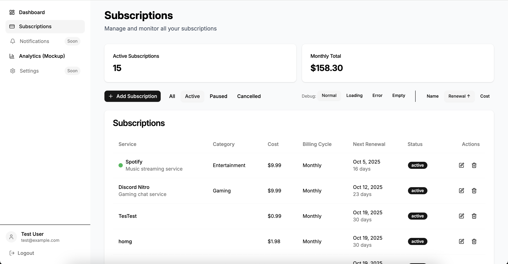

# Subscription Tracker

> **Interview Project for Rainmaker** | Professional subscription management platform built in 16-20 hours

A modern subscription tracking application that helps users manage recurring subscriptions, monitor spending patterns, and receive intelligent renewal notifications.

**📊 [API Documentation](http://localhost:3001/api-docs)** | **🏗️ [System Architecture](./docs/TECHNICAL_DECISIONS.md)** | **🎯 [Demo Highlights](./working-docs/demos/DEMO_SCRIPT_NOTES.md)**

## Tech Stack

**Frontend:** React Router 7 + TypeScript + TanStack Query + Radix UI + shadcn/ui
**Backend:** Node.js + Express + TypeScript + Mongoose + node-cron
**Infrastructure:** Docker Compose + MongoDB + Redis + Scheduled Jobs
**Auth & Security:** JWT + bcryptjs + protected routes + input validation
**Testing:** Unit, integration & E2E tests with Vitest + MongoDB Memory Server + Playwright

## ⚡ Quick Start

**Prerequisites:** Node.js 22+, Docker, pnpm

```bash
# 1. Clone and setup environment files (see Environment Setup below)
# 2. Install dependencies and start infrastructure
docker-compose -f docker-compose.dev.yml up -d  # MongoDB + Redis + admin tools
cd frontend && pnpm install && pnpm run dev      # Terminal 1
cd backend && pnpm install && pnpm run dev       # Terminal 2

# 3. Visit the application
# Frontend: http://localhost:5173
# API Docs: http://localhost:3001/api-docs
```

**Two Docker configs:** `dev.yml` (includes admin tools) vs `prod.yml` (optimized runtime)

📋 **[Complete Setup Guide](./docs/SETUP_GUIDE.md)** - Detailed environment configuration, troubleshooting, and commands

## 🎯 Key Features & Technical Highlights

### **Smart Currency Detection** → [Technical Details](./docs/TECHNICAL_DECISIONS.md#smart-currency-detection)
- **Timezone-based detection** with locale fallback system
- **43+ supported currencies** with proper formatting
- **Auto-detection flow:** User timezone → Country mapping → Currency selection

### **Intelligent Service Autocomplete**
- **30+ popular services** with logos, categories, and pricing data
- **Auto-category setting** when selecting suggested services
- **Free-form input** with smart suggestions for custom services

### **Smart Data Management**
- **TanStack Query** for intelligent caching and background sync
- **Optimistic updates** with automatic rollback on failure
- **Background refetching** for always-current subscription data

### **Background Job System** → [Technical Details](./docs/TECHNICAL_DECISIONS.md#email-notification-system)
- **Node-cron scheduling** for reliable notification processing
- **Industry-standard billing logic** handling edge cases (Jan 31st → Feb 28th → Mar 31st)
- **Email notifications** with HTML templates via Resend
- **Configurable reminder periods** and notification preferences

### **Interactive State Testing**
- **Debug UI controls** for demonstrating different application states
- **Loading, error, and empty state variations** accessible via in-app buttons
- **Interview-friendly feature** allowing quick demonstration of UX handling
- **Home page controls:** Normal, Loading, Error, Empty states
- **Subscriptions page controls:** Normal, Loading, Error, Empty with contextual messaging


*Subscription management interface showing state controls and professional UI handling*

### **Secure Authentication**
- **JWT-based authentication** with localStorage persistence
- **Protected routes** and API endpoint security
- **Session management** with automatic token refresh

## 🚀 Development Commands

```bash
# Start development environment
docker-compose -f docker-compose.dev.yml up -d  # Infrastructure + admin tools
pnpm run dev  # Start both frontend and backend

# Admin interfaces (development only)
# http://localhost:8081 - Mongo Express (MongoDB GUI)
# http://localhost:8082 - Redis Commander (Redis GUI)

# Testing and validation
pnpm run test        # Run test suite
pnpm run typecheck   # TypeScript validation
```

📋 **[Development Workflow](./AGENTS.md)** - Complete commands, troubleshooting, and best practices

## 📚 Documentation

### **System Design & Architecture**
- **[Technical Decisions](./docs/TECHNICAL_DECISIONS.md)** - Key design choices, challenges, and scaling considerations
- **[Library Choices](./docs/LIBRARY_CHOICES.md)** - Rationale for chosen libraries and time-saving decisions
- **[Best Practices](./docs/BEST_PRACTICES.md)** - Form validation, TypeScript patterns, and development standards
- **[Deployment Guide](./docs/DEPLOYMENT_OPTIONS.md)** - Railway, Docker, and production setup

### **API & Development**
- **[API Documentation](http://localhost:3001/api-docs)** - Interactive Swagger/OpenAPI docs (available during development)
- **[Database Schema](./docs/DATABASE_SCHEMA.md)** - MongoDB collections and indexes
- **[Development Workflow](./AGENTS.md)** - Setup, commands, and best practices

## 🔧 Environment Setup

**Three configuration files required:**
```bash
cp .env.example .env                    # Docker infrastructure
cp backend/.env.example backend/.env    # Backend application
cp frontend/.env.example frontend/.env  # Frontend client
```

📋 **[Complete Environment Guide](./docs/SETUP_GUIDE.md#environment-configuration)** - Detailed configuration and troubleshooting

## 🤖 AI Tool Disclosure

This project was developed with extensive assistance from **Claude Code** for:

**AI-Assisted Implementation:**
- Form component scaffolding and validation logic
- TypeScript error resolution and type safety improvements
- API endpoint implementation and testing
- UI component development and styling
- Database schema design and optimization
- Documentation generation and formatting

**Human-Designed Architecture:**
- **System design and data modeling** - Query patterns, database relationships, API structure
- **UX planning and user flows** - Paper mockups, interaction patterns, accessibility considerations
- **Business logic and edge cases** - Billing date calculations, currency detection strategies
- **Technical decision-making** - Library choices, deployment strategy, testing approach
- **Project planning and prioritization** - Feature scope, time management, quality vs speed trade-offs

**Philosophy:** AI accelerated implementation velocity while human judgment guided architectural decisions and user experience design.

## 📋 Project Deliverables

- ✅ **GitHub Repository** with comprehensive documentation
- ✅ **Working Application** with Docker development environment
- ✅ **API Documentation** via interactive Swagger UI
- ✅ **Technical Documentation** covering design decisions and scaling considerations

## 🏗️ Production-Grade Architecture

```
┌──────────────────────┐    ┌──────────────────────┐    ┌─────────────────┐
│   React Router 7     │───▶│  Express + TypeScript│───▶│   MongoDB       │
│   TanStack Query     │    │  JWT + Validation    │    │   Mongoose ODM  │
│   Radix UI + shadcn  │    │  BullMQ Jobs         │    │   Aggregations  │
└──────────────────────┘    └──────────────────────┘    └─────────────────┘
                                        │
                                        ▼
                               ┌─────────────────┐
                               │   Node-cron Jobs│
                               │   Email Scheduler│
                               │   (Redis ready) │
                               └─────────────────┘
```

**Enterprise-Level Features:**
- **Frontend:** Type-safe forms with Zod validation, optimistic updates, professional UI components
- **Backend:** Comprehensive middleware stack, background job processing, industry-standard date calculations
- **Database:** Optimized indexes, aggregation pipelines, edge case handling for financial data
- **Infrastructure:** Docker Compose environments, scheduled job system, email notification system

🎯 **[Technical Deep-Dive](./docs/TECHNICAL_DECISIONS.md)** | **[Demo Highlights](./working-docs/demos/DEMO_SCRIPT_NOTES.md)**

---

**📧 Contact:** For questions about implementation details or technical decisions, please see the documentation links above or review the commit history for development context.